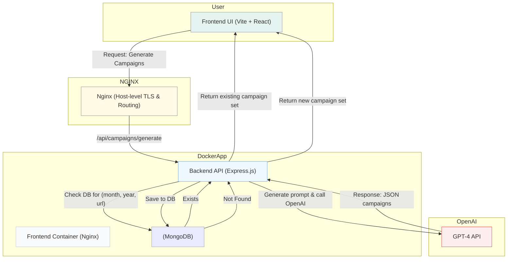

# AppMail Challenge

## Demo
[Link to demo https://appmail.slidegate.xyz](https://appmail.slidegate.xyz)

## Architecture Overview



## Campaign Backend
[Campaign Backend README](/campaign-backend/README.md)

## Campaign Frontend
[Campaign Frontend README](/campaign-frontend/README.md)

## Installation & Setup
### Requirement:
- Local machine should have Docker to build the Docker container

### Installation
1. Clone the code base to your local.

2. Create a `.env` following the `.env.example` for backend

``` bash
cd campaign-backend
cat .env.example >> .env
```

3. Build the docker container:

``` bash
cd .. # incase you are still inside ./campaign-backend
docker compose up --build -d
```

- Once the container completed building up, access the UI via http://localhost:3000

## Further enhancement
1. Add in jwt and/or oauth for all sort of authentications. Via combination of url / month / year / user account, we can restrict the number of times per user per month/year can generate for each url.
2. CI/CD via Github Action to automate the deployment to my test server. (I will do it if I have spare time)
3. Enhance the flow in UI.