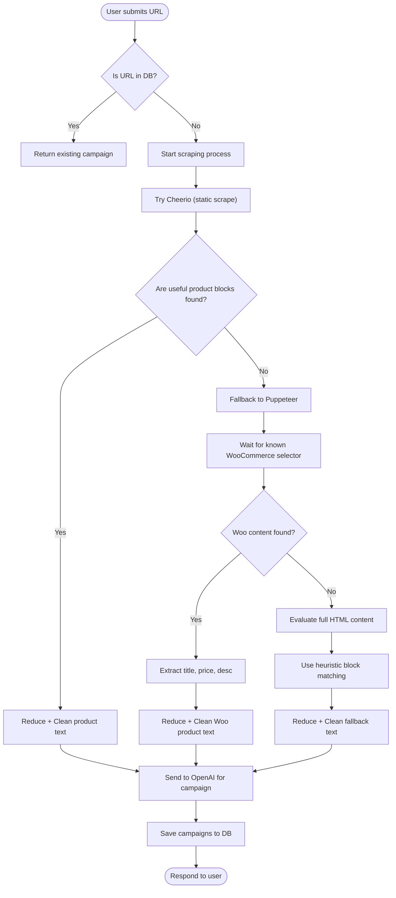

## 📣 Campaign Backend (Express + OpenAI + MongoDB)

This backend service generates a dynamic series of email marketing campaigns using the OpenAI API, then stores the structured JSON output in a MongoDB database.

### Flow


### 📦 Tech Stack
* Node.js / Express.js
* MongoDB with Mongoose
* OpenAI GPT-4 API
* Docker + Docker Compose

### 🚀 Features
* Generate 10 email campaign ideas based on:
  * Month & Year
  * Key marketing dates
  * Product catalog
* Structured response in strict JSON format
* Store in MongoDB
* Ready for user authentication layer
* Dockerized for local development & future deployment

### 🛠 Setup & Run
1. Clone and install dependencies
```bash
git clone https://github.com/yourname/campaign-backend.git
cd campaign-backend
npm install
```

2. Create a .env file
```env
OPENAI_API_KEY=your_openai_key_here
MONGO_URI=mongodb://mongo:27017/campaigns
PORT=3000
```

3. Start with Docker
```bash
docker-compose up --build
```

App runs on: http://localhost:3000
MongoDB exposed at: mongodb://localhost:27017/campaigns

### 🧪 API Usage
`POST /campaigns/generate`

Request Body:
```json
{
  "month": "May",
  "year": 2025,
  "url": "https://example.com"
}
```

Response:

Returns an array of 10 campaign objects with metadata.

### 📁 Project Structure
```
.
├── controllers/          # Route logic
│   └── campaignController.js
├── models/               # Mongoose schema
│   └── Campaign.js
├── routes/               # Express routing
│   └── campaign.js
├── services/             # OpenAI wrapper
│   └── openaiService.js
├── index.js              # App entrypoint
├── Dockerfile
├── docker-compose.yml
├── .env
├── .dockerignore
└── README.md
```

### 🧱 To Do (Optional Enhancements)
* User authentication (JWT)
* Prevent duplicate campaign generation per user/month/year
* Admin dashboard or campaign preview API
* GitHub Actions for CI/CD deployment